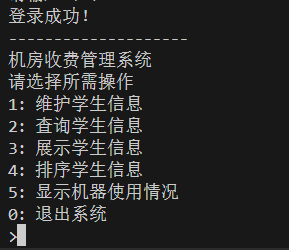

# 一、实验内容

机房管理系统用于对机房学生上机信息进行管理，要求能够完成的主要功能包括学生信息录入和修改、学生上机时长、费用的计算以及机器使用状况查看等操作。要求使用学习过的 C/C++程序设计的知识完成图书管理系统的设计与实现。

# 二、运行环境

机房管理系统在 Visual Studio Code 1.89.1 平台下开发，操作系统：Windows 11 23H2
硬件环境：
处理器：13th Gen Intel(R) Core(TM) i9-13900HX 2.20 GHz
内存：32.0 GB
系统类型：64 位操作系统

# 三、实验课题分析

本课题旨在开发一套机房收费管理系统，满足以下功能要求：

-   菜单功能选择：通过菜单实现功能的选择，方便用户操作。
-   学生信息维护：实现对学生上机信息的增、删、改功能，包括学号、班级、姓名、上机起止时间等信息的管理。
-   查询功能：按照班级、学号、姓名等条件查询并显示学生的上机时间。
-   排序显示：能够按照学号、班级、上机开始时间和上机时长进行排序并显示。
-   费用计算：根据上机时间计算上机费用，每小时收费 1 元，不足一小时按一小时计算。
-   机器使用情况显示：能够直观显示当前机器的使用情况。
-   信息读写文件：将所有信息读写文件，方便数据的持久化存储和管理。

本系统的主要功能模块有：

-   登录模块
-   信息维护模块
-   信息展示模块

系统各模块的功能具体描述为：

## 1.登录模块

选择登录身份（学生、管理员），输入用户名和密码，成功后进行相应的功能模块。
退出登录的时候则要保存当前系统的所有状态，包括学生上机信息和机器使用情况

## 2.信息维护模块

-   添加：进入添加状态，根据提示依次输入学生上机基本信息，默认状态下不能重新输入（但是可以通过修改功能进行修改）
-   修改：选择索引，并输入相关信息进行查找，按照提示选择修改项进行修改
-   删除：选择索引进行修改，并输入相关信息查找目标信息。删除的时候将会展示将要删除的信息让用户进行确认，如有重复将会展示索引，并让用户选择删除的条目

## 3.信息展示模块

-   学生上机信息查询：可以通过学生姓名和学生的学号进行查询学生信息。
-   学生上机信息排序：可以通过不同条件对信息的展示进行排序。排序只作用于信息的展示模块，而不作用于信息的查询模块。
-   学生上机信息展示：展示数据库中学生的信息，并根据排序信息模块的规则进行输出
-   机器状态展示：展示机器占用情况，并展示使用者的账号

## 四、系统分析及设计

整个程序的变量使用小驼峰的命名方式，并且尽量在变量名上对变量的功能进行诠释。

系统文件结构如下：

```
│
├── main.cpp # 主程序入口
├── README.md # 项目说明文档
│
├── docs/ # 程序文档
│
├── data/ # 数据存储目录
│ ├── admins.txt # 管理员账号信息
│ ├── users.txt # 用户账号信息
│ |── machines.txt # 机器使用情况日志文件
│ └── data.txt # 学生上机信息数据文件
│
├── src/ # 源代码目录
| |── login.cpp # 登录功能模块
│ ├── menu.cpp # 菜单功能模块
│ ├── info.cpp # 学生信息维护模块
│ ├── userList.cpp # 链表
│ ├── machine.cpp # 机器使用情况显示模块
│ └── file_manager.cpp # 文件读写模块
|
└── include/ # 头文件目录
| |── login.h
| |── menu.h
| |── info.h
| |── userList.h
| |── listNode.h
| |── list.h
| |── machine.h
| └── file_manager.h
|
└── README.md
```

我们设计了 menu 类进行菜单的管理和展示，使代码更加简洁和优雅，提高代码的复用性，系统入口用 Login 类进行登录进入系统。对于学生信息，我们设计了 Info 类进行存储和管理，并使用链表进行组织。使用 MachineMap 类进行机器使用状况的管理和展示，并使用 file 类进行文件的读写操作。

# 五、系统的实现

## 类的编写

具体类的声明如下：

登录

```cpp
class LoginSystem {
   private:
    std::unordered_map<std::string, std::string> users;
    void loadUsersFromFile(const std::string& filename);

   public:
    LoginSystem(const std::string& filename);
    bool login();
};
```

菜单

```cpp
class Menu {
   public:
    void displayUserType();

    void displayMainMenu();

    void displayMaintainMenu();

    void displayFetchMenu();

    void displayChangeMenu();

    void displayDeleteMenu();
};
```

机器使用状况

```cpp
class MachineMap {
   public:
    // 更新机器使用状态
    MachineMap(const std::string, const std::string);
    void init();
    void changeMachineStatus(std::string, std::string);
    void updateMachineStatus(Info&, Info&);
    bool isMachineFree(const std::string&);
    // 保存到文件
    void saveToFile();
    void displayMap();

   private:
    std::map<std::string, std::string>
        machineStatus;  // 机器编号到使用状态的映射
    std::string fileType;
    std::string path;
};
```

用户信息类

```cpp
class Info {
   public:
    Info();
    ~Info();
    const std::string& getName() const;
    const std::string& getNum() const;
    const std::string& getClassName() const;
    const std::string& getMachineNum() const;
    const std::string& getBeginTime() const;
    const std::string& getEndTime() const;
    const int& getTotalTime() const;
    const double& getCost() const;

    void setName(const std::string& name);
    void setNum(const std::string& num);
    void setClassName(const std::string& className);
    void setMachineNum(const std::string& machineNum);
    void setBeginTime(const std::string& beginTime);
    void setEndTime(const std::string& endTime);

    void setTotalTime();
    void calculateCost(const int& totalTime);

    friend std::istream& operator>>(std::istream& in, Info& right);
    // friend std::ifstream& operator>>(std::ifstream& in, Info& right);
    friend std::ostream& operator<<(std::ostream& out, const Info& right);

   private:
    std::string name = "-";
    std::string num = "-";
    std::string className = "-";
    std::string machineNum = "-";
    std::string beginTime = "-";
    std::string endTime = "-";
    int totalTime = 0;
    double cost = 0;
};
```

链表节点的声明

```cpp
class ListNode {
   public:
    ListNode();

    T getData() const;

    T& getData();

    void setData(T data);

    ListNode* getNext() const;

    ListNode* getNext();

    void setNext(ListNode* next);

    ListNode* getPrior() const;

    ListNode* getPrior();

    void setPrior(ListNode* prior);

    template <typename T_>
    friend std::istream& operator>>(std::istream& in, ListNode<T_>& right);

    template <typename T_>
    friend std::ostream& operator<<(std::ostream& out,
                                    const ListNode<T_>& right);

   private:
    T data;           // 元素数据
    ListNode* next;   // 后一节点
    ListNode* prior;  // 前一节点
};

template <typename T>
T ListNode<T>::getData() const {
    return data;
}

template <typename T>
void ListNode<T>::setData(T data) {
    ListNode::data = data;
}

template <typename T>
ListNode<T>* ListNode<T>::getNext() const {
    return next;
}

template <typename T>
void ListNode<T>::setNext(ListNode* next) {
    ListNode::next = next;
}

template <typename T>
ListNode<T>* ListNode<T>::getPrior() const {
    return prior;
}

template <typename T>
void ListNode<T>::setPrior(ListNode* prior) {
    ListNode::prior = prior;
}

template <typename T>
std::istream& operator>>(std::istream& in, ListNode<T>& right) {
    T temp = T();
    in >> temp;
    right.setData(temp);
    return in;
}

template <typename T>
std::ostream& operator<<(std::ostream& out, const ListNode<T>& right) {
    return out << right.getData() << std::endl;
}

template <typename T>
ListNode<T>::ListNode() : next(nullptr), prior(nullptr) {}

template <typename T>
T& ListNode<T>::getData() {
    return data;
}

template <typename T>
ListNode<T>* ListNode<T>::getNext() {
    return next;
}

template <typename T>
ListNode<T>* ListNode<T>::getPrior() {
    return prior;
}
```

链表的使用

```cpp
template <typename T>
class List {
   public:
    List();

    ~List();

    int getSize();

    ListNode<T>* getHead();

    T& addNode(std::istream&);

    void delNode(int);

    ListNode<T>& operator[](int);

    void display();

   protected:
    int size;           // 链表长度
    ListNode<T>* head;  // 头节点
    ListNode<T>* tail;  // 尾节点
};

template <typename T>
T& List<T>::addNode(std::istream& in) {
    // 往尾节点的后面添加新的节点
    auto newNode = new ListNode<T>();
    T newData;
    in >> newData;

    newNode->setData(newData);
    newNode->setNext(nullptr);
    newNode->setPrior(tail);
    if (tail) {
        // 尾节点不为空时挂上新节点
        tail->setNext(newNode);
    }
    tail = newNode;  // 更新尾节点
    if (head == nullptr) {
        // 头节点为空时初始化头节点
        head = newNode;
        head->setPrior(nullptr);
    }
    ++size;
    return newNode->getData();
}

template <typename T>
List<T>::List() {
    // 初始化链表
    size = 0;
    head = nullptr;
    tail = nullptr;
}

template <typename T>
List<T>::~List() {
    ListNode<T>* ptr = tail;
    ListNode<T>* ptr_ = nullptr;
    while (ptr->getPrior() != nullptr) {
        // 从尾节点开始逐步释放空间
        ptr_ = ptr->getPrior();
        delete ptr;
        ptr = ptr_;
    }
    delete ptr;

    size = 0;
    ptr = nullptr;
    ptr_ = nullptr;
}

template <typename T>
ListNode<T>& List<T>::operator[](int index) {
    // 重载[]运算符以实现查询与修改功能
    // 用的简单的遍历，可能还有优化空间
    ListNode<T>* ptr = head;
    int size_ = 0;
    if (index >= size) {
        index = size - 1;
    }
    while (size_ < index) {
        ptr = ptr->getNext();
        ++size_;
    }
    return *ptr;
}

template <typename T>
void List<T>::delNode(int index) {
    // 通过普通的遍历来实现删除节点
    ListNode<T>* ptr = head;
    ListNode<T>* ptr_ = nullptr;
    int size_ = 0;
    if (index >= size) {
        // 下标越界时删除尾节点
        index = size - 1;
    }
    while (size_ < index) {
        // 遍历寻找目标节点
        ptr_ = ptr;
        ptr = ptr->getNext();
        ++size_;
    }

    if (ptr_ && ptr->getNext()) {
        // 普通情况
        ptr_->setNext(ptr->getNext());
        ptr->getNext()->setPrior(ptr_);
    } else if (ptr_) {
        // 目标节点为尾节点时
        ptr_->setNext(nullptr);
        tail = ptr_;
    } else if (ptr->getNext()) {
        // 目标节点为头节点时
        ptr->getNext()->setPrior(nullptr);
        head = ptr->getNext();
    } else {
        // 目标节点为链表中的唯一节点时
        tail = nullptr;
        head = nullptr;
    }

    --size;
    delete ptr;
    ptr = nullptr;
}

template <typename T>
int List<T>::getSize() {
    // 获取链表长度
    return size;
}

template <typename T>
void List<T>::display() {
    // 输出链表内所有元素
    displayHeader();
    ListNode<T>* ptr = head;
    while (ptr) {
        std::cout << *ptr;
        ptr = ptr->getNext();
    }
    std::cout << std::endl;
}

template <typename T>
ListNode<T>* List<T>::getHead() {
    return head;
}
```

用户的链表方法

```cpp
class UserList : public List<Info> {
   public:
    ListNode<Info>* fetchNode(const std::string&, const std::string&);

    void fetchNode();

    void delNode(const std::string&, const std::string&);

    void changeNode(std::string, const std::string&);

    void changeNode_info(std::string);

    void sortNode();

   private:
    void sort(bool (*cmp)(const ListNode<Info>&, const ListNode<Info>&));

    void swap(ListNode<Info>*, ListNode<Info>*);
};
```

机器使用状况

```cpp
class MachineMap {
   public:
    // 更新机器使用状态
    MachineMap(const std::string, const std::string);
    void init();
    void changeMachineStatus(std::string, std::string);
    void updateMachineStatus(Info&, Info&);
    bool isMachineFree(const std::string&);
    // 保存到文件
    void saveToFile();
    void displayMap();

   private:
    std::map<std::string, std::string>
        machineStatus;  // 机器编号到使用状态的映射
    std::string fileType;
    std::string path;
};
```

文件操作类

```cpp
class File {
   public:
    File(const std::string, const std::string);

    void init(UserList&);

    void add(Info&);

    void change(UserList&);

   private:
    std::string path;
    std::string fileType;
};
```

## 链表的使用

-   添加节点 ：
    T& addNode(std::istream& in)：
    从输入流中读取数据，并创建一个新的节点。
    将新节点添加到链表的尾部，更新尾节点指针。
    如果链表为空，初始化头节点。
    更新链表长度。
-   删除节点：
    void delNode(int index)：
    通过遍历找到指定位置的节点。
    重新链接前后节点，移除目标节点。
    更新头尾节点指针（如果删除的是头或尾节点）。
    释放目标节点的内存，更新链表长度。
-   访问节点：
    ListNode<T>& operator[](int index)：
    通过遍历找到指定位置的节点，返回该节点的引用。
    提供链表的随机访问能力，但效率较低。
-   获取链表长度：
    int getSize()：
    返回链表的当前长度。
-   显示链表：
    void display()：
    遍历链表，从头节点开始依次输出每个节点的数据。
-   UserList 类的扩展功能
    -   fetchNode：根据用户的姓名和学号获取节点。
    -   delNode：根据用户的姓名和学号删除节点。
    -   changeNode 和 changeNode_info：根据学号或其他条件修改节点信息。
    -   sortNode：对链表节点进行排序。

我们的链表和节点是分开写的，这样有很多好处。首先，调试上我们可以进行分层处理，节点的错误不会直接影响链表，从而影响排查效率。第二，我们分开写的话，可以不用管节点的类型，不用因为节点元素的改变而去修改我们整个链表，链表的功能独立于节点而存在，实现了系统的解耦合，提升了代码的鲁棒性。

这里我们依照报告范例进行一个介绍。
————学生上机信息的管理就表现为链表的操作，拿上机信息来说，学生上机信息的查找、修改、添加和删除与链表的查找、修改、添加和删除相对应。
以图书查找为例子：
用户在查询图书的时候，有两种不同的模式：

三种情况都需要对链表中的所有数据进行顺序的搜索。例如书名的查找。我们根据用户输入，传入一个 type 类型的数据标识查找方法。然后，ListNode<Info>\* ptr = head;一句定义了头指针，然后后面就是标准的暴力遍历了。通过 getData()方法获取节点中的数据，然后再调用响应的类方法获取数据，如 getNum()，与用户输入的数据进行比对。


## 数据的读取和存储

数据的储存和读取主要通过 File 类来实现。
我们进入系统时，系统默认会从 data 目录下读取数据文件，若无数据文件，将提示用户并自动创建。这一过程主要由 init 成员函数实现：

```cpp
void File::init(UserList& userList) {
    std::ifstream in;
    in.open(path + fileType, std::ios::in);
    if (!in.is_open()) {
        std::ofstream out;
        out.open(path + fileType, std::ios::out | std::ios::app);
        out.close();
        in.open(path + fileType, std::ios::in);
    }
    if (!in.is_open()) {
        std::cerr << "无法打开data.txt " << path + fileType << std::endl;
        return;
    }
    std::string line;
    while (std::getline(in, line)) {
        std::istringstream iss(line);
        userList.addNode(iss);
    }
    // userList.display();
    in.close();
    std::cout << "data初始化成功！" << std::endl;
}
```

我们在向链表中添加节点信息的时候，系统会先调用 info 类中重载的输入流函数，并提示用户进行数据的录入。这一过程为了避免更多问题的产生，默认无法退出。信息添加到新建的 info 对象之后，将会将该对象添加到链表中，然后我们再对文件进行操作。这个过程我们为了减少大量文件的读写操作，我们采用 change 的方法对修改进行保存。

```cpp
void File::change(UserList& userList) {
    std::ofstream out;
    out.open(path + ".temp", std::ios::app);
    if (!out.is_open()) {
        std::cout << "data.txt文件打开失败" << std::endl;
        return;
    }
    auto ptr = userList.getHead();
    if (ptr) {
        out << ptr->getData();
        ptr = ptr->getNext();
    }
    while (ptr) {
        out << ptr->getData();
        ptr = ptr->getNext();
    }
    out.close();
    remove((path + fileType).c_str());
    rename((path + ".temp").c_str(), (path + fileType).c_str());
}
```

首先系统会产生一个 temp 后缀的文件来记录我们的修改，将 UserList 链表中的所有节点数据写入一个临时文件，然后用该临时文件替换原来的文件。这样做的原因主要是当链表中的数据发生变化时，需要将这些变化保存到文件中。直接覆盖原始文件存在一定风险，如果程序在写入过程中崩溃，可能导致数据损坏。通过临时文件的方式，可以保证在整个写入过程中数据的一致性。只有当所有数据成功写入临时文件后，才会替换原始文件。

这种方法启发于数据库的事务处理。先进行临时操作（写入临时文件），如果操作全部成功，再进行提交（替换原始文件），否则回滚（保留原始文件）。文件操作的原子性：rename 操作在大多数文件系统上是原子的，这意味着它要么完全成功，要么完全失败，不会出现部分完成的情况。

## 交互界面以及登录菜单的实现

我本意是做一个控制台窗口选中文字高亮显示，这样就会相对比较美观。但是考虑到这个过程需要使用 windows 系统的 api，还是决定放弃这个功能，因为这样做可能会降低程序的兼容性，带来一些不必要的问题。

我主要使用 Menu 类对菜单进行简单的封装，主要通过选择结构和循环结构实现界面的前进和后退，让代码更加简洁美观。
例如进入系统时候登录选择的主菜单：

````cpp
void Menu::displayUserType() {
    std::cout << std::setw(20) << std::setfill('-') << "-" << std::endl;
    std::cout << "机房收费管理系统" << std::endl;
    std::cout << "请输入你的用户类型" << std::endl;
    std::cout << "1: 管理员" << std::endl;
    std::cout << "2: 学生" << std::endl;
    std::cout << "0: 退出系统" << std::endl;
    std::cout << ">";
}
主函数中的调用如下:
```cpp
int userType = 0;
menu.displayUserType();
while (std::cin >> userType) {
    switch (userType) {
        case 1: {}
    }
    if(userType) displayUserType();
}
````

但是这样也给程序带来了一些不足之处，因为我们的获取用户输入的变量 userType 是 int 类型，这样一来，用户在输入除数字以外其他的字符的时候就会导致 cin 抛出一个错误，while 循环也就随之退出了。这样程序就会毫无征兆的退出。针对这个问题我觉得是可以得到解决的，但是问题在于我们的 switch。如果捕获输入的变量是其他类型，解决方法也不是没有，但是整体的代码就会显得相对冗杂。因此我选择增加用户提示的方式来尽量减少这种情况的发生

## 用户信息类的实现

info 类是这个程序中最重要的类。几乎封装了所有与用户信息相关的方法

```cpp
Info::Info() = default;
Info::~Info() = default;
const std::string& Info::getName() const {
    return name;
}
const std::string& Info::getNum() const {
    return num;
}
const std::string& Info::getClassName() const {
    return className;
}
const std::string& Info::getMachineNum() const {
    return machineNum;
}
const std::string& Info::getBeginTime() const {
    return beginTime;
}
const std::string& Info::getEndTime() const {
    return endTime;
}
const int& Info::getTotalTime() const {
    return totalTime;
}
const double& Info::getCost() const {
    return cost;
}

void Info::setName(const std::string& name) {
    Info::name = name;
}
void Info::setNum(const std::string& num) {
    Info::num = num;
}
void Info::setClassName(const std::string& className) {
    Info::className = className;
}
void Info::setMachineNum(const std::string& machineNum) {
    Info::machineNum = machineNum;
}
void Info::setBeginTime(const std::string& beginTime) {
    Info::beginTime = beginTime;
}
void Info::setEndTime(const std::string& endTime) {
    Info::endTime = endTime;
}

void Info::setTotalTime() {
    if (Info::beginTime == "-" || Info::endTime == "-")
        Info::totalTime = 0;
    else
        Info::totalTime = getMinuteDifference(beginTime, endTime);
}

void Info::calculateCost(const int& totalTime) {
    Info::cost = std::ceil(totalTime / 60.0) * 1;
}

std::istream& operator>>(std::istream& in, Info& right) {
    if (typeid(in) == typeid(std::cin)) {
        std::cout << "请输入该用户的学号：";
        in >> right.num;
        std::cout << "请输入该用户的姓名：";
        in >> right.name;
        std::cout << "请输入班级：";
        in >> right.className;
        std::cout << "请输入机器号码：";
        std::string machineNum;
        while (in >> machineNum) {
            if (mp.isMachineFree(machineNum) == true) {
                right.setMachineNum(machineNum);
                break;
            } else {
                std::cout << "该机器已被占用，请重新选择：";
            }
        }
        std::regex timePattern(R"(^([01][0-9]|2[0-3]):[0-5][0-9]$)");

        std::string begintime;
        std::cout << "请输入上机开始时间:";
        while (in >> begintime) {
            if (std::regex_match(begintime, timePattern)) {
                right.setBeginTime(begintime);
                break;
            } else {
                std::cout << "时间格式不正确，应为 HH:MM:(英文冒号)";
            }
        }
    } else {
        in >> right.num >> right.name >> right.className >> right.machineNum >>
            right.beginTime >> right.endTime >> right.totalTime >> right.cost;
    }
    return in;
}

std::ostream& operator<<(std::ostream& out, const Info& right) {
    // out << std::left << std::setw(10) << "学号" << "姓名" << "班级"
    //     << "机器编号" << "上机开始时间" << "上机结束时间" << "上机时长"
    //     << "费用" << std::endl;
    if (typeid(out) == typeid(std::cout)) {
        out << std::setfill(' ') << "|" << std::setw(15) << right.getNum()
            << "|" << std::setw(10) << right.getName() << "|" << std::setw(10)
            << right.getClassName() << "|" << std::setw(15)
            << right.getMachineNum() << "|" << std::setw(10)
            << right.getBeginTime() << "|" << std::setw(10)
            << right.getEndTime() << "|" << std::setw(10)
            << right.getTotalTime() << "|" << std::setw(15) << right.getCost()
            << "|";
    } else {
        out << right.getNum() << " " << right.getName() << " "
            << right.getClassName() << " " << right.getMachineNum() << " "
            << right.getBeginTime() << " " << right.getEndTime() << " "
            << right.getTotalTime() << " " << right.getCost();
    }

    return out;
}
```

我们将输入运算符重载为友元函数。并且对输入流进行了区分。从输入流中读取用户信息，如果输入流是 std::cin，则提示用户输入各项信息并使用 regex 库所提供的正则表达式方法进行格式验证（如机器号是否已被占用，时间格式是否正确）。如果输入流是文件流，则直接读取数据。

# 六、实验调试、测试、运行记录及分析

系统在调试测试过程中遇到若干问题，不过经过仔细反复的检查已经消除各种 bug
主要的测试经过如下：


输入 1 进入管理员界面：


输入用户名密码，如:
用户名：admin
密码：admin

然后进入管理员操作界面



遇到的问题及解决方法如下：

## 【菜单逻辑不正确，从二级菜单返回一级菜单的时候菜单不展示】

解决方法是我们通过在 while 循环中采用以下的菜单结构：

```cpp
while (std::cin >> userType && userType) {
    switch(userType){
        case 1: // Todo
        case 2: // Todo
    }
    if(userType){
        // Display Menu
    }
}
```

这样一来，用户输入错误的时候就可以提示错误，并要求用户重新输入

## 从文件中读取数据时，会多读写一行

原来的代码是这样的：

```cpp
while (!file.eof()) {
    std::getline(file, line);
    // Todo
}
```

这个方法存在缺陷，主要表现为读取文件数据的时候会多出来一行很奇怪的东西。但是经验告诉我，这种奇怪的数据极有可能是读取的东西是空的导致的。于是我换了一种写法他就正常了。

```cpp
while (std::getline(file, line)) {
    // Todo
}
```

这个问题也是让我想了一会。最后发现其实主要原因是 eof() 检查是在文件读取之后的状态，而不是在尝试读取之前检查。如果文件刚好在最后一次读取时达到 EOF，循环可能会多执行一次，导致处理多余的空行或无效数据。如果要解决上面的哪个问题，其实在 while 循环中再加上一句 if 判断就行了。

```cpp
while (!file.eof()) {
    std::getline(file, line);
    if (file.eof()) break;
    // Todo
}
```

# 七、不足和反思

用户输入的时候，如果输入非数字字符，cin 将会抛出错误并导致 while 循环的退出，这样一来整个程序就非正常退出了。但是我们的程序中暂时没有对这个问题进行解决。希望在以后的完善中进一步解决这个问题
